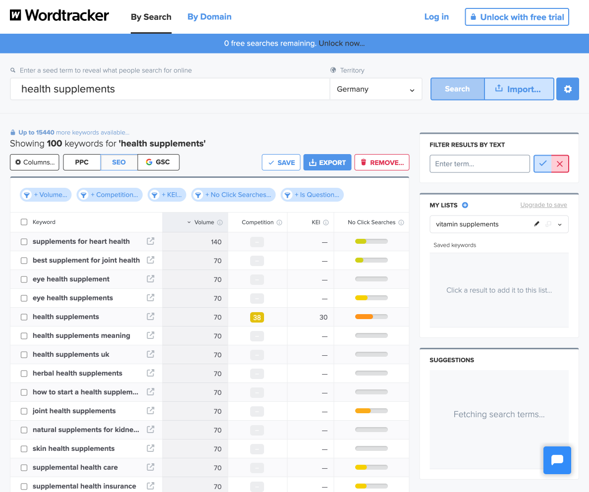
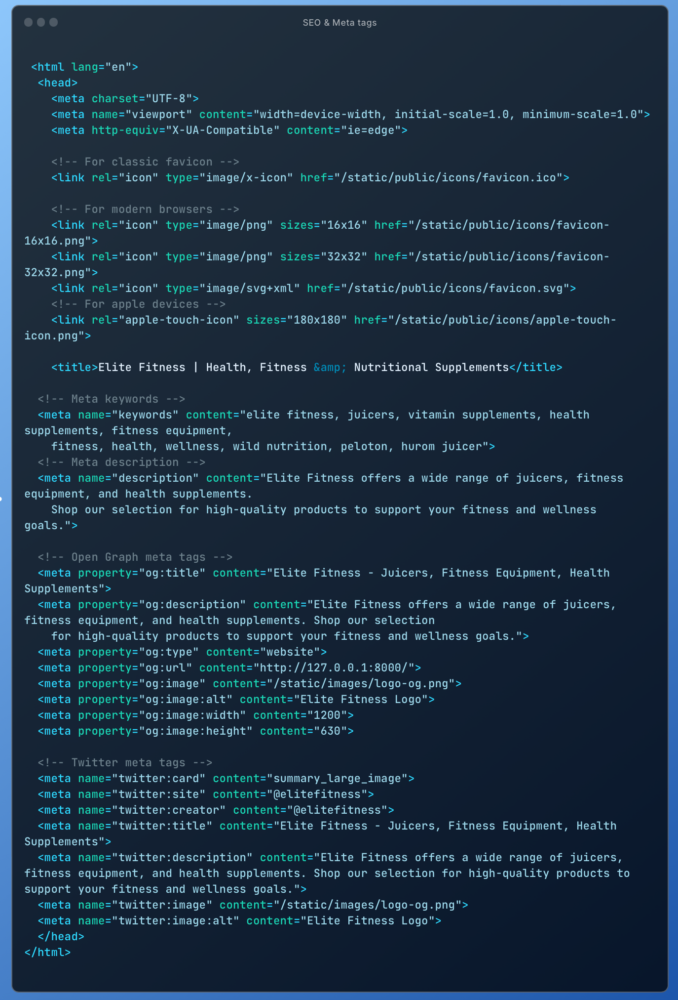
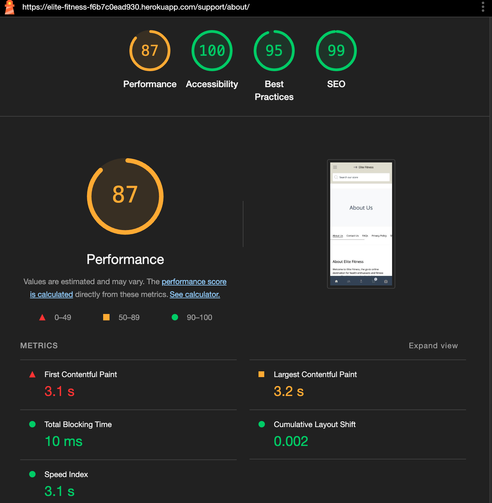
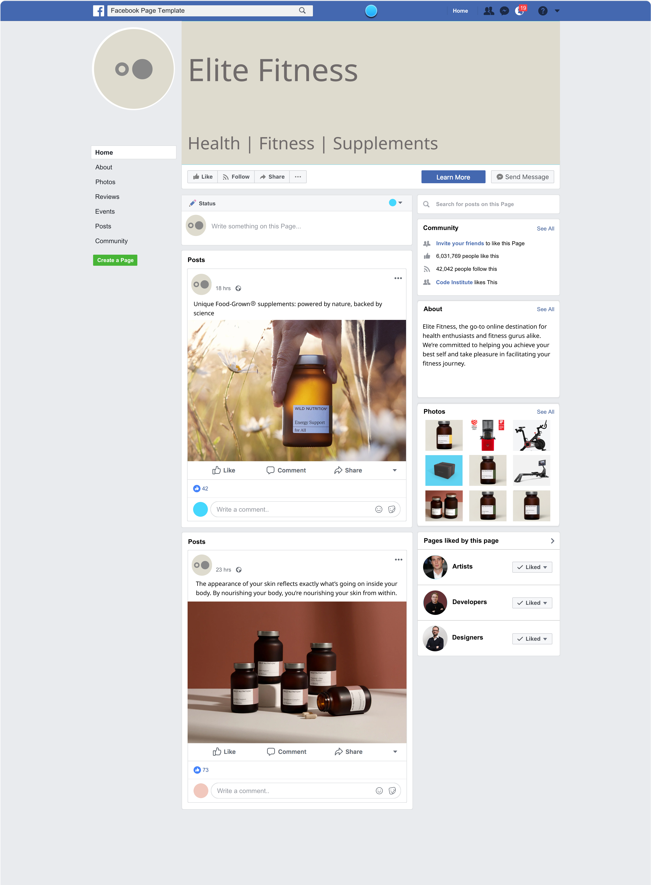
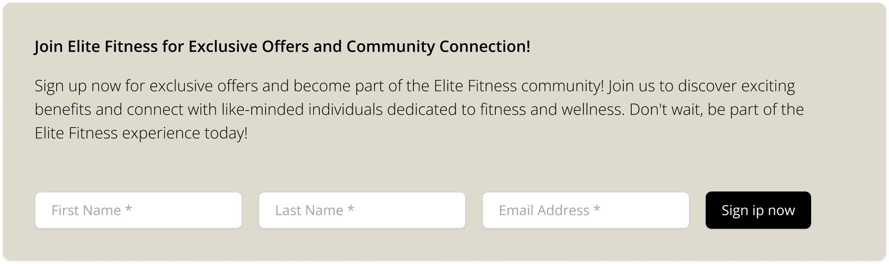
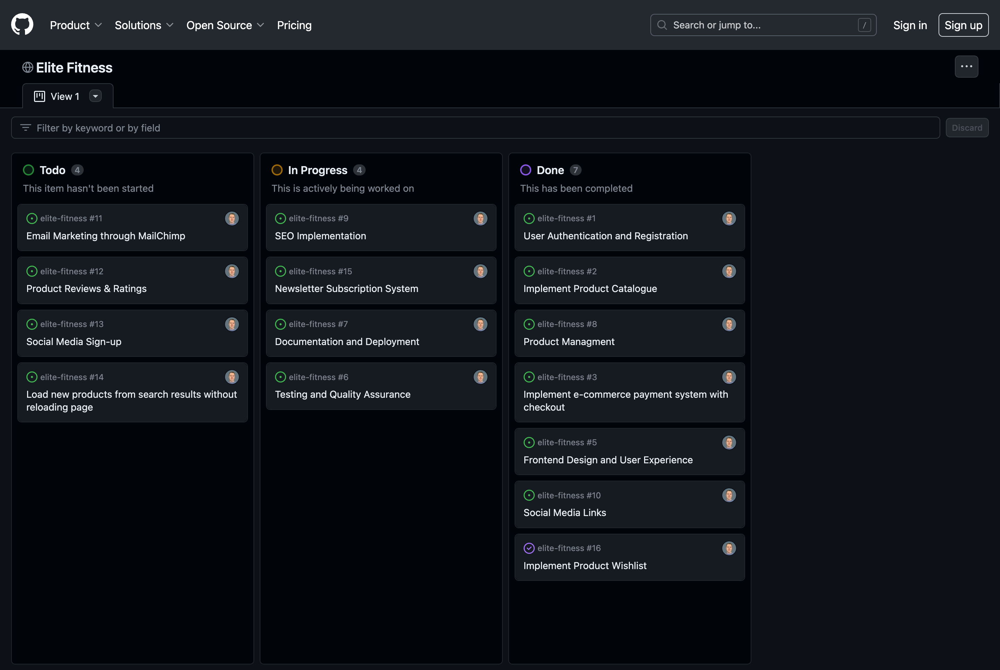
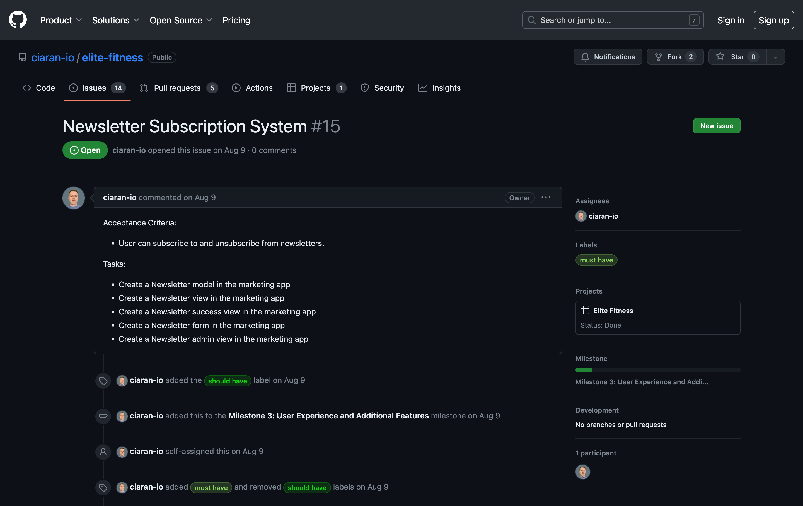
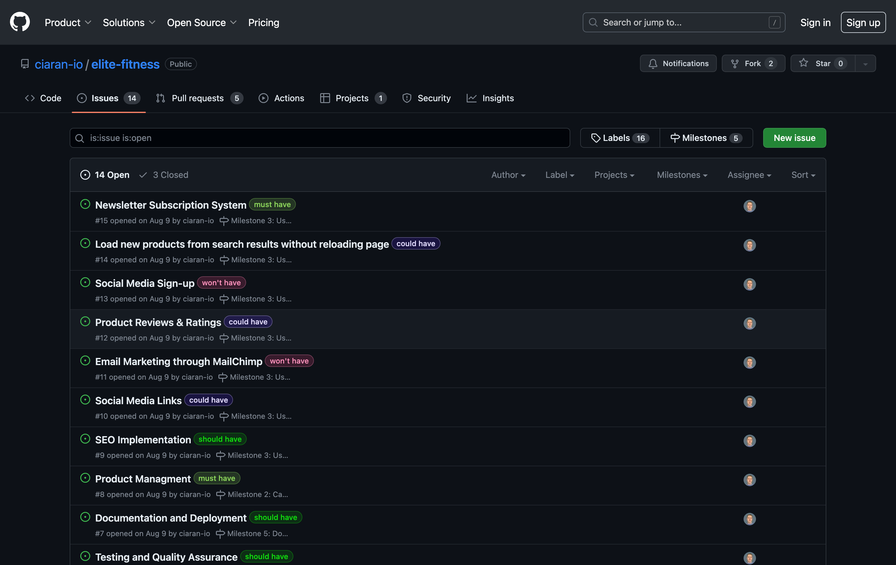

# ELITE FITNESS 

Welcome to Elite Fitness, the leading online destination for health supplements, fitness equipment, and juicers.
Our dedicated store is committed to assisting individuals in their pursuit of optimal health and wellness.
We are deeply passionate
about empowering our customers by offering convenient access to high-quality health supplements,
fitness equipment, and juicers.

Our primary objective is to provide our customers with the benefits of health and fitness,
delivered directly to their doorstep.
We prioritise enhancing the online shopping experience for our customers,
which includes fitness enthusiasts, health-conscious individuals,
and those aspiring to make positive changes in their well-being.

Leveraging our online platform, we present a wide selection of products carefully tailored to boost physical fitness, support holistic well-being, and aid our customers in accomplishing their individual fitness objectives. Whether you're a fitness newcomer in need of basic training equipment or a passionate athlete after advanced performance supplements, Elite Fitness accommodates everyone, regardless of their experience level.

Beyond being an e-commerce store, Elite Fitness serves as a powerful tool to inspire, guide,
and motivate our customers toward a healthier lifestyle.
It revolutionises the way customers can shop for their fitness essentials, all from the comfort of their own homes.

Our aim is to reach not only those already familiar with the benefits of our product range,
but also individuals that are embarking on their fitness journey.
Providing them with guidance on the path to improved health, strength, and vitality.
Embark on this transformative journey to wellness with us.
Your Elite Fitness experience begins here.

## 🌄 [View live website](https://elite-fitness-f6b7c0ead930.herokuapp.com)

To enhance readability and ease maintenance, the Readme files have been reorganised into separate markdown files.

- [🎨 View Design documentation](./DESIGN.md#ux--ui-)
- [🔓 View Security documentation](./SECURITY.md#security-)
- [✨ View Features documentation](./FEATURES.md#features-)
- [🧪 View Testing documentation](./TESTING.md#testing-)
- [🚀 View Deployment documentation (Local & Production)](./DEPLOYMENT.md#deployment-)

## Target audience

The target audience for our website includes diverse individuals united by a common interest: health and fitness.
This wide-ranging group encompasses avid gym-goers looking for the next piece of equipment to elevate their workout
routine,
health-conscious consumers seeking quality supplements to support their nutritional needs, and even those just beginning
their wellness journey who are in search of a transformative lifestyle change.

The goal was to make the platform inclusive and appealing to all, regardless of age, physical condition, or fitness
expertise level. Elite Fitness caters to the inexperienced novice, the dedicated veteran, and every fitness enthusiast
in-between, making Elite Fitness a comprehensive resource for anyone invested in improving their health and well-being.

## Business Model

### Canvas Structure

1. **Value Proposition:** We offer a carefully curated lineup of premium health and fitness products that meet the
   diverse needs of the health-conscious consumer, including fitness equipment, supplements, and juicers with single
   item purchases, fast home delivery, and responsive customer support.
2. **Customer Segments:** Primary customers are fitness enthusiasts, health-conscious individuals, diet &
   wellness-conscious families & athletes.
3. **Channels:**
   - Website: Users can explore and purchase our products on a user-friendly platform.
   - Customer Support Line: Includes email and contact form for queries and concerns.
   - Social Media: Regular updates, promotions and community engagement, including fitness guidance.
   - Email Newsletters: Regular updates about new products, special offers, and industry trends.

4. **Customer Relationships:**
   - Customer Service: Available five days a week to help with orders, shipping, and product inquiries.
   - Customer Feedback: Regular surveys to collect feedback, reviews, and suggestions, aiding in constant improvement.

5. **Key Activities:**
   - Product procurement
   - Website and e-commerce management
   - Order fulfillment and customer service
   - Marketing and community engagement

6. **Key Resources:**
   - Stock of health and fitness products
   - E-commerce website
   - Warehouse facilities and delivery partners
   - Customer service team
   - Digital marketing team

7. **Key Partners:**
   - Health and fitness products manufacturers
   - Third-party logistics partners
   - Payment gateway providers
   - Digital marketing agencies
   - Fitness trainers and nutritionists for content creation

8. **Revenue Streams:**
   - Sale of health and fitness products
   - Shipping & handling fees
   - Revenue from affiliate marketing or special partnerships

9. **Cost Structure:**
   - Inventory costs
   - Logistics and warehousing expenses
   - E-commerce platform maintenance
   - Employee salaries
   - Marketing and PR expenses

### Market Research

#### 1. Market Overview

- **Global Size & Trends**: The European health and wellness market is growing rapidly, estimated to exceed €200 billion
  by the end of 2025, according to Statista.
- **Local Analysis**: Ireland, known for its high health consciousness level, presents an appealing market. A report by
  Ireland's Department of Business, Enterprise, and Innovation highlighted a rise in online sales in the health and beauty sector.
- **Industry Dynamics**: The increasing digitisation and tech-savvy population in Ireland and Europe have driven a shift
  towards online shopping for wellness and fitness products.

#### 2. Customer Analysis

- **Demographics**: The target audience might be individuals aged 25-45, gender-neutral, with an average annual income
  above the Irish average of approximately €35,000.
- **Psychographics**: The customers are likely to value physical activity, follow dietary regimes like paleo,
  high-protein, plant-based or gluten-free, and exhibit high awareness of health and wellness trends.
- **Purchase Behavior**: Irish and European consumers tend to research products online, compare prices, read reviews,
  and show a strong preference for online shopping due to its convenience and extensive product choices.

#### 3. Competitor Analysis

- **Competitor Identification**: Direct competitors can include global online retailers such as Amazon's health/fitness
  category or Europe-based fitness e-commerce platforms like Gymshark. Indirect competitors can be local health and
  fitness stores in Ireland.
- **Competitor Strategies**: Free shipping within Europe, discounts, and coupling products with free wellness advice are
  common strategies among competitors.
- **Competitor Strengths / Weaknesses**: Amazon's vast range and fast delivery can be seen as strengths. However, a lack of personalized service and specialist focus can be potential weaknesses.

#### 4. Pricing Analysis

- **Competitor Prices**: The pricing for health and fitness products varies among retailers. For instance, the average
  price of protein supplements is about €30 for 1kg across various online platforms.
- **Cost Evaluation**: Adding operational costs, shipping, and desired profit to the base cost of goods would dictate
  our pricing strategy while ensuring competitiveness.
- **Customer Willingness**: According to market surveys, most health-conscious consumers in Ireland and Europe are
  willing to pay a bit more for higher quality, sustainable, and certified health and fitness products.

#### 5. Legal and Regulatory Considerations

- **Product Safety and Compliance**: All products should meet European Union and Irish safety standards. This includes
  ensuring that all health and fitness products are correctly labelled and comply with any standards for ingredients,
  production methods, etc.

- **Distance Selling Regulations**: Understand the rules and regulations for online and distance selling, which include
  providing clear information about products, prices, and delivery costs, as well as complying with rules for
  cancellations and returns.

- **Accessibility Standards**: The online store should be accessible to consumers of all abilities, in accordance with
  EU and Irish accessibility laws. This might affect how your website is designed, including the provision of features
  for the visually impaired, for example.

- **Cybersecurity**: Ensure the e-commerce platform being used is secure, adheres to relevant cybersecurity laws and
  standards, and implements required security measures to protect customer data, like SSL certification.

- **Returns and Refunds Policies**: According to the EU and Irish law, consumers purchasing online have the right to
  return products under certain conditions. The website should contain a refund policy accordingly.

#### 6. Trends and Opportunities

- **Informed Consumers**: The rising trend of eco-friendliness and sustainability in Europe can be catered to by
  offering environmentally friendly fitness gear along with organic, plant-based supplements.
- **Fitness Boom**: High-intensity interval training (HIIT) and yoga are trendy in Ireland. Therefore, selling products
  related to these, like yoga mats, weights, resistance bands can tap into this growing demand.
- **Subscription Boxes**: A curated 'health box' with various wellness products for monthly subscription can cater to
  the European preference for convenience and novelty.

### SWOT Analysis

#### Strengths

1. **Wide Product Variety**: Having a broad array of products caters to different customers' needs and tastes. This
   means we can attract a larger audience, and customers can get all their needs in one place, increasing the chances of
   repeat business.
2. **User-friendly Interface**: Building a user-friendly website and app can significantly enhance customer satisfaction
   by making shopping seamless and enjoyable. This may lead to an increase in sales, the frequency of purchases, and
   customer retention rates.

#### Weaknesses

1. **Competitive Market**: The health and fitness sector is highly saturated with many established brands. New entrants
   face stiff competition, which makes it a challenge to attract customers and ensure repeat business.
2. **Inventory Management Challenges**: Trying to maintain a wide variety of products may lead to complex inventory
   management. Tracking and managing inventory levels can become difficult, and any errors may lead to overspending on
   inventory or stockouts.

#### Opportunities

1. **Increasing Health Awareness**: The global trend towards healthy living means more people are seeking out health and
   fitness products. As more people grow conscious of their health and fitness, demand for your products can be expected
   to increase.
2. **Online Shopping Growth**: E-commerce persists in its consistent growth year after year, with an increasing number
   of people embracing its convenience for their shopping needs. This upswing in online shopping, driven by evolving
   consumer behavior and technological advancements, promises to endure. By delivering a consistent and seamless
   shopping experience, businesses stand to seize substantial opportunities for expansion and growth.

## Marketing Strategy

### 1. Understand The Target Audience

Given a projected online survey, it would be plausible to predict that Elite Fitness's primary customer base consists largely of working professionals, specifically within the age group of 30-45. This prediction stems from the brand's focus on marketing premium products like upscale workout gear alongside superior quality, organic supplements — commodities that generally appeal to those with established careers.

By linking these attributes to lifestyle needs and the age group's buying power, it becomes evident that this demographic would be drawn to premium quality products, signifying their commitment both to their professional roles and personal fitness goals. These individuals often have higher disposable income, allowing them to invest in products that harmoniously align with their lifestyle choices, health goals, and ethical considerations. Therefore, Elite Fitness theoretically aligns well with these consumer needs and preferences, making the brand an attractive option for such a target audience.

### 2. Unique Value Proposition (UVP)

Elite Fitness, the Unique Value Proposition (UVP) could be phrased as: "Delivering premium,
organic health supplements and high-quality fitness equipment right to your doorstep."
This UVP lends emphasis to the brand's dedication to premium quality and customer convenience,
aligning with the needs of individuals who prioritise their fitness and health.
It seamlessly integrates wellness products into customers'
everyday lives by facilitating easy online purchase and direct home delivery.

### 3. SEO Implementation

| Activities           | Details                                                                                                                                                  | Screenshot                                                                            |
|----------------------|----------------------------------------------------------------------------------------------------------------------------------------------------------|---------------------------------------------------------------------------------------|
| Keyword optimization | Optimised the website for keywords such as "best high-quality health supplements" & "premium home fitness equipment"                                     |                                |
| SEO Practices        | The metadata, descriptions, and alt text for images were all developed with these keywords in mind                                                       |                             |
| Website Quality      | Elite Fitness ensures quick website loading times, a seamless checkout process, mobile-responsiveness, and employs an SSL certificate for extra security |  |

### 4. Content Marketing

To further enhance customer engagement and create a sense of community, Elite Fitness could consider implementing a
feature that allows users to contribute their own posts to the blog.
This user-generated content integration would
enable customers to share their opinions, personal experiences, and knowledge on health, fitness, nutrition, and
supplements.
Benefits of this feature implementation include:

1. Increased user engagement: Allowing users to contribute their own blog posts fosters a sense of involvement and
   encourages them to actively participate in discussions and share their expertise.
2. Diverse perspectives: User-generated content adds variety to the blog by bringing in different viewpoints and
   experiences, enriching the overall content offering.
3. Enhanced credibility: Customer-generated posts can inspire trust and credibility among readers as they provide
   authentic insights and personal experiences related to health, fitness, nutrition, and supplements.
4. Expanded organic traffic: By encouraging users to share their posts on social media and other platforms, the blog's
   reach can be extended, attracting more organic traffic and potential customers to the site.
5. Community building: Implementing user-generated content creates a community around the blog, fostering connections
   and interactions among users who share a common interest in health and wellness.
   This future implementation has the potential to further strengthen Elite Fitness's blog as a valuable resource,
   enrich the content offerings, and drive sustained organic traffic.

### 5. Social Media Marketing

**Mockup Facebook page:**

Implementing a strong social media presence on platforms like Facebook, Instagram, and TikTok could provide numerous
benefits for the business, including increased brand exposure, enhanced customer engagement, and the potential to
attract new customers.
By actively posting engaging content and collaborating with influencers, the business could reach
a wider audience and increase brand awareness.
The use of effective hashtags on these platforms can help maximise
visibility and make it easier for users to discover health & fitness related content.

Additionally, features like Q&A sessions and user-generated content foster a sense of community and authenticity,
leading to stronger customer loyalty and trust. The interactive nature of social media platforms allows for direct
engagement with customers, enabling the business to address their queries, provide valuable insights, and gather
feedback.

Furthermore, social media platforms offer opportunities for viral trends and challenges, helping to boost the brand's
visibility and potentially attract new customers. Overall, leveraging the power of Facebook, Instagram, and TikTok could
significantly benefit the business by expanding your reach, fostering customer connections, and driving growth.

**Facebook:**

- Create and maintain an active Facebook page for Elite Fitness.
- Regularly post engaging content such as workout routines, health tips, and product updates.
- Collaborate with fitness influencers to create and share content featuring Elite Fitness products.
- Utilize effective hashtags like #FitWithEliteFitness to increase reach and engagement.
- Conduct Facebook Live sessions for Q&A sessions or fitness classes.
- Share user-generated content and testimonials to build social proof.

**Instagram:**

- Establish an official Instagram account for Elite Fitness.
- Post visually appealing and inspiring content related to fitness, workouts, and healthy living.
- Leverage Instagram Stories to share behind-the-scenes content, workouts, and exclusive promotions.
- Collaborate with fitness influencers and micro-influencers for sponsored posts and product endorsements.
- Engage with followers by responding to comments, direct messages, and hosting Instagram Live sessions.
- Utilize relevant fitness and health-related hashtags to increase discoverability and reach a wider audience.

**TikTok:**

- Create an engaging TikTok account for Elite Fitness.
- Share short fitness and workout videos, showcasing exercises, fitness challenges, and transformations.
- Participate in viral TikTok trends and challenges, adapting them to the fitness and health niche.
- Collaborate with TikTok influencers or fitness enthusiasts to create duets, challenges, or sponsored content.
- Interact with the TikTok community by responding to comments, creating live streams, and engaging in duets or
  stitches.
- Utilize popular fitness and wellness-related hashtags to increase visibility and engagement.

### 6. Email Marketing

Implementing email marketing strategies could provide several benefits for the business.
The benefits of email marketing could include increased customer engagement,
brand loyalty, and potentially higher conversions.
It allows the business to regularly communicate with customers, educate them about products,
and provide valuable content that enhances their overall fitness journey.
An effective email marketing strategy could nurture customer relationships and encourage repeat purchases.

Weekly Newsletter:

- Running a weekly newsletter allows Elite Fitness to regularly engage with their audience and provide helpful content.
- Sharing information like the "Protein Supplement of the Week" positions the business as a trusted source of product
  recommendations.
- By frequently featuring customer testimonials, the newsletter builds social proof, encouraging potential customers to
  trust and try the featured products.
  Email Sequence for New Customers:
- Creating an email sequence for new customers helps to establish a positive and personalised relationship from the
  start.
- The warm welcome email sets the tone and makes customers feel valued and appreciated.
- Follow-up emails featuring best practices for using the products not only educate customers but also helps them
  maximise the benefits and outcomes of their purchase.
- Providing tips for maintaining equipment and additional resources adds value to the customer's experience, fostering
  loyalty and customer satisfaction.

### 8. Subscription Form

Mockup Subscription Form (implemented on Homepage):

The subscription form featured on the homepage necessitates the input of a first name, last name, and email address. To ensure accuracy, the form undergoes validation through the Django forms module. Once validated, the form is submitted to the database, and the user is promptly redirected to the homepage. Subsequently, a success message is displayed to the user, and an email containing a confirmation link is dispatched to prevent spam. Upon confirmation of their details, the user will be directed to a subscription success page.

The subscription form plays a pivotal role in business growth. It serves not only as a communication tool, but also as a viable metric to measure customer engagement and interest. Subscriptions pave the way for a higher customer retention rate, providing a platform for sending newsletters, personalized offerings, updates, and promotions, directly linking revenue growth with frequent, ongoing customer interactions. Potential benefits include increased traffic to the website, deeper customer engagement, better potential for upselling/cross-selling, targeted marketing through data collection, and improved customer loyalty.

#### Key Points:

-  **Customer Retention:** Subscriptions strengthen customer relationships and increase retention.
-  **Revenue Growth:** Regular customer interactions foster higher sales through upselling/cross-selling opportunities.
-  **Targeted Marketing:** Subscription information provides demographic and behavioural data, enabling personalized, targeted marketing.
-  **Customer Engagement:** Newsletters and updates can attract subscribers back to the website, increasing their engagement with the brand.
-  **Customer Loyalty:** Regular, personalized contact enhances customer loyalty and builds strong brand advocates.

### 7. Advertising

Running a Facebook ad campaign featuring the home workout equipment range,
specifically targeting professionals aged 30-45 residing in urban areas,
could prove to be a successful strategy for the business.
The campaign could provide significant results, including an increase in website traffic and an increase in sales.

A successful Facebook ad campaign would demonstrate the importance of tailored targeting,
compelling ad creative, and a relevant product offering in maximising reach, engagement, and sales.
The investment
in utilising Facebook as an advertising platform has the potential
to result in a notable increase in website traffic and sales,
positioning the business for further growth and success.

**The benefits of a Facebook ad campaign include:**

- Increased Website Traffic: The targeted campaign may drive more traffic to the website, attracting professionals in
  the desired age group and geographic areas. This not only could increase brand visibility but also provides an
  opportunity for potential customers to explore and engage with the products.

- Higher Sales: A campaign success could potentially increase sales. By specifically reaching out to professionals in
  urban areas, the business could capture the attention of individuals who may be seeking convenient fitness solutions
  for their busy lifestyles.

- Improved Reach and Engagement: A successful campaign could increase the brand's reach and engagement, leading to more
  followers and potential customers. This could help the business build a loyal customer base and position the business
  for further growth and success.

### 8. Measure, Analyze, and Optimise

**Feature: Content Topic Analysis and Recommendation**

By leveraging data analytics tools like Google Analytics, Elite Fitness could analyze user behavior, search patterns,
and engagement metrics to identify popular content topics. This feature would involve:

1. Topic Analysis: Analyzing the performance metrics of existing blog posts, such as page views, time spent on page, and
   bounce rates, to determine the most popular topics among the target audience. In this case, Elite Fitness discovered
   that health supplements and the benefits of organic products resonated well with their audience.

2. Recommendation Engine: Providing relevant content topic suggestions based on user preferences, search trends, and
   competitive analysis. This feature would give content creators insights to help them produce high-performing content.

3. Search Engine Optimization (SEO) Guidance:
   Assisting in-house content creators in optimising articles for search engines by providing keyword recommendations,
   search volume analysis, and on-page SEO guidelines.
   This would improve
   the visibility of the content and contribute to improved search rankings.

Benefits of this feature implementation include:

1. Data-driven decision-making: By relying on data analytics, Elite Fitness can make informed decisions about content
   topics, ensuring they align with audience interests and preferences.
2. Increased web traffic: Creating more content around health supplements and organic products based on user preferences
   led to a further increase in web traffic. Content strategy optimization ensures that the topics covered are
   well-received and attract more organic traffic.
3. Improved search rankings: By implementing SEO guidance, Elite Fitness could better optimise content for search
   engines, leading to improved visibility and higher search rankings.
4. Enhanced content quality: Recommendations provide valuable insights that can help in-house content creators produce
   high-quality, relevant, and engaging content that resonates with the target audience.

By applying data-driven insights and informed recommendations, Elite Fitness could optimize its content strategy, attract more visitors, and improve search engine rankings, leading to sustained growth and success.

## Agile Development Process

During development of the project, Agile development methodologies were leveraged,
employing tools like GitHub Project Boards, GitHub Issues, and MoSCoW Prioritization.
GitHub Project Boards were instrumental in maintaining a visual overview of the project's progress.
They facilitated the organization of tasks into columns
corresponding to various stages of completion—from idea conception to final product -
ensuring structured, transparent workflow management.
GitHub Issues acted as a powerful tool for tracking tasks, bugs, and feature requests.
They supported an interactive dialog between team members,
providing a clear, effective method for team communication on specific project elements,
thus promoting efficiency in problem-solving.

The MoSCoW Prioritization technique played a critical role in defining the project's scope and managing expectations.
It helped categorize tasks into Must have, Should have, Could have, and Won't have,
which allowed for transparent decision-making in terms of feature importance,
thereby enabling efficient allocation of resources.

Implementing Agile methodologies within this project ensured a responsive,
adaptable development process while fostering consistent progress and high-quality output.
The practices mentioned above ensured efficient workflow,
improving product delivery times and promoting a more collaborative and flexible project environment.

### 1. Project Management

#### 1.1 GitHub Project Boards

The project utilised GitHub Project Boards to track the progress of our development efforts.

- **Todo Column**: Any item (We.e., user story or bug) deemed ready for development was moved here.
- **In Progress Column**: Items currently being worked on were moved into this column.
- **Done Column**: Completed and closed items were moved here.

#### 1.2 GitHub Issues

GitHub Issues were used to track individual pieces of work.

- Each user story and bug had its own GitHub Issue.
- Metadata (like labels for priority, type, and who was assigned) was added to each issue.
- Commits were linked to issues to track work being done.

### 2. Development

#### 2.1 MoSCoW Prioritization

To prioritise the work, I used the MoSCoW method, assigning each issue a priority level:

- **Must Have**: These were mission-critical requirements the project could not do without.
- **Should Have**: Important but not vital requirements. Could be postponed if necessary.
- **Could Have**: Desirable requirements, but could be dropped without significant loss or impact.
- **Won't Have**: These were agreed to be unnecessary, to be addressed at a later time, or were beyond the scope of the
  current iteration.

At the start of each sprint, Must Have and Should Have issues were prioritised.
It helped to maintain a steady flow in the project by keeping focus on high-value, high-impact work.

### 3. Conclusion

The combination of Agile Development practices, GitHub Project Boards, GitHub Issues, and MoSCoW Prioritization led to 
a successful and effective project. By continuously iterating, I maintained a high level of quality while rapidly
delivering working software.

## 💾 Database Design & Schema

The Database schema was created using [draw.io](https://www.drawio.com/)
Download the [drawsql file](../docs/design/database/database-schema.drawio) to view or edit the schema.

### Database Models

> [!NOTE] Note
>
> Please note that in the formulated table, the "PK" and "FK" annotations indicate the primary key and foreign key
> constraints, respectively.
> The user_id column is a foreign key referencing auth_user(id).
> The data types and additional notes for each column are also provided.
> Please refer to the table definitions below for more information.
> Click on `▶︎ View the database schema table definitions ` dropdown menu to expand the table definitions.

---

- [account_email_address](#accountemailaddress)
- [account_email_confirmation ](#accountemailconfirmation)
- [accounts_deliverydetails ](#accountsdeliverydetails)

---

- [auth_group ](#authgroup)
- [auth_group_permissions ](#authgrouppermissions)
- [auth_permission ](#authpermission)
- [auth_user ](#authuser)
- [auth_user_groups ](#authusergroups)
- [auth_user_user_permissions ](#authuseruserpermissions)

---

- [django_site ](#djangosite)

---

- [orders_order ](#ordersorder)
- [orders_orderlineitem ](#ordersorderlineitem)

---

- [products_attribute ](#productsattribute)
- [products_benefit ](#productsbenefit)
- [products_brand ](#productsbrand)
- [products_category ](#productscategory)
- [products_image ](#productsimage)
- [products_keybenefit ](#productskeybenefit)
- [products_product ](#productsproduct)
- [products_product_attributes ](#productsproductattributes)
- [products_product_category ](#productsproductcategory)

---

- [subscriptions_subscription ](#subscriptionssubscription)

---

- [wishlist_list ](#wishlistlist)
- [wishlist_list_products ](#wishlistlistproducts)

---

  
 View the database schema table definitions 

#### `account_emailaddress`

| PK | id (unique) | Type         | Notes                        |
|----|-------------|--------------|------------------------------|
| FK | user_id     | Integer      | FK, references auth_user(id) |
|    | email       | Varchar(254) |                              |
|    | primary     | Boolean      |                              |
|    | verified    | Boolean      |                              |

#### `account_emailconfirmation`

| PK | id (unique)      | Type        | Notes                                   |
|----|------------------|-------------|-----------------------------------------|
| FK | email_address_id | Integer     | FK, references account_emailaddress(id) |
|    | created          | Datetime    |                                         |
|    | sent             | Datetime    |                                         |
|    | key              | Varchar(64) |                                         |

#### `accounts_deliverydetails`

| PK | id (unique)             | Type         | Notes                  |
|----|-------------------------|--------------|------------------------|
| FK | user_id                 | Integer      |                        |
|    | default_full_name       | Varchar(50)  |                        |
|    | default_email           | Varchar(254) |                        |
|    | default_phone_number    | Varchar(20)  | max_len=20, blank=true |
|    | default_country         | Varchar(2)   |                        |
|    | default_postcode        | Varchar(20)  |                        |
|    | default_town_or_city    | Varchar(40)  |                        |
|    | default_street_address1 | Varchar(80)  |                        |
|    | default_street_address2 | Varchar(80)  |                        |
|    | default_county          | Varchar(80)  |                        |

#### `auth_group`

| PK | id (unique) | Type         | Notes |
|----|-------------|--------------|-------|
|    | name        | Varchar(150) |       |

#### `auth_group_permissions`

| PK | id (unique)   | Type    | Notes                              |
|----|---------------|---------|------------------------------------|
| FK | group_id      | Integer | FK, references auth_group(id)      |
| FK | permission_id | Integer | FK, references auth_permission(id) |

#### `auth_permission`

| PK | id (unique)     | Type         | Notes                                  |
|----|-----------------|--------------|----------------------------------------|
| FK | content_type_id | Integer      | FK, references django_content_type(id) |
|    | codename        | Varchar(100) |                                        |
|    | name            | Varchar(255) |                                        |

#### `auth_user`

| PK | id (unique)  | Type         | Notes |
|----|--------------|--------------|-------|
|    | password     | Varchar(128) |       |
|    | last_login   | Datetime     |       |
|    | is_superuser | Boolean      |       |
|    | username     | Varchar(150) |       |
|    | last_name    | Varchar(150) |       |
|    | email        | Varchar(254) |       |
|    | is_staff     | Boolean      |       |
|    | is_active    | Boolean      |       |
|    | date_joined  | Datetime     |       |
|    | first_name   | Varchar(150) |       |

#### `auth_user_groups`

| PK | id (unique) | Type    | Notes                         |
|----|-------------|---------|-------------------------------|
| FK | user_id     | Integer | FK, references auth_user(id)  |
| FK | group_id    | Integer | FK, references auth_group(id) |

#### `auth_user_user_permissions`

| PK | id (unique)   | Type    | Notes                              |
|----|---------------|---------|------------------------------------|
| FK | user_id       | Integer | FK, references auth_user(id)       |
| FK | permission_id | Integer | FK, references auth_permission(id) |

#### `django_site`

| PK | id (unique) | Type         | Notes |
|----|-------------|--------------|-------|
|    | name        | Varchar(50)  |       |
|    | domain      | Varchar(100) |       |

#### `orders_order`

| PK | id (unique)     | Type         | Notes                                            |
|----|-----------------|--------------|--------------------------------------------------|
| FK | user_profile_id | Bigint       | FK, references accounts_deliverydetails(user_id) |
|    | order_number    | Varchar(32)  |                                                  |
|    | full_name       | Varchar(50)  |                                                  |
|    | email           | Varchar(254) |                                                  |
|    | phone_number    | Varchar(20)  | max_len=20, blank=true                           |
|    | country         | Varchar(2)   |                                                  |
|    | postcode        | Varchar(20)  |                                                  |
|    | town_or_city    | Varchar(40)  |                                                  |
|    | street_address1 | Varchar(80)  |                                                  |
|    | street_address2 | Varchar(80)  |                                                  |
|    | county          | Varchar(80)  |                                                  |
|    | date            | Datetime     |                                                  |
|    | delivery_cost   | Decimal      |                                                  |
|    | order_total     | Decimal      |                                                  |
|    | grand_total     | Decimal      |                                                  |
|    | original_cart   | Text         |                                                  |
|    | stripe_pid      | Varchar(254) |                                                  |
|    | status          | Varchar(20)  |                                                  |

#### `orders_orderlineitem`

| PK | id (unique)    | Type    | Notes                               |
|----|----------------|---------|-------------------------------------|
| FK | order_id       | Bigint  | FK, references orders_order(id)     |
| FK | product_id     | Bigint  | FK, references products_product(id) |
|    | quantity       | Integer |                                     |
|    | lineitem_total | Decimal |                                     |

#### `products_attribute`

| PK | id (unique) | Type        | Notes |
|----|-------------|-------------|-------|
|    | type        | Varchar(50) |       |
|    | name        | Varchar(50) |       |

#### `products_benefit`

| PK | id (unique) | Type         | Notes                               |
|----|-------------|--------------|-------------------------------------|
| FK | product_id  | Bigint       | FK, references products_product(id) |
|    | title       | Varchar(100) |                                     |
|    | description | Text         |                                     |

#### `products_brand`

| PK | id (unique) | Type         | Notes |
|----|-------------|--------------|-------|
|    | name        | Varchar(50)  |       |
|    | slug        | Varchar(100) |       |

#### `products_category`

| PK | id (unique) | Type         | Notes |
|----|-------------|--------------|-------|
|    | name        | Varchar(100) |       |
|    | slug        | Varchar(150) |       |

#### `products_image`

| PK | id (unique) | Type          | Notes                               |
|----|-------------|---------------|-------------------------------------|
| FK | product_id  | Bigint        | FK, references products_product(id) |
|    | image       | Varchar(100)  |                                     |
|    | alt_text    | Varchar(200)  |                                     |
|    | img_url     | Varchar(1024) |                                     |

#### `products_keybenefit`

| PK | id (unique) | Type         | Notes                               |
|----|-------------|--------------|-------------------------------------|
| FK | product_id  | Bigint       | FK, references products_product(id) |
|    | title       | Varchar(250) |                                     |

#### `products_product`

| PK | id (unique) | Type         | Notes                             |
|----|-------------|--------------|-----------------------------------|
| FK | brand_id    | Bigint       | FK, references products_brand(id) |
|    | created     | Datetime     |                                   |
|    | updated     | Datetime     |                                   |
|    | sku         | Varchar(15)  |                                   |
|    | slug        | Varchar(200) |                                   |
|    | description | Text         |                                   |
|    | name        | Varchar(150) |                                   |
|    | is_active   | Boolean      |                                   |
|    | is_reviewed | Boolean      |                                   |
|    | price       | Decimal      |                                   |
|    | stock       | Integer      |                                   |

#### `products_product_attributes`

| PK | id (unique)  | Type   | Notes                                 |
|----|--------------|--------|---------------------------------------|
| FK | product_id   | Bigint | FK, references products_product(id)   |
| FK | attribute_id | Bigint | FK, references products_attribute(id) |

#### `products_product_category`

| PK | id (unique) | Type   | Notes                                |
|----|-------------|--------|--------------------------------------|
| FK | product_id  | Bigint | FK, references products_product(id)  |
| FK | category_id | Bigint | FK, references products_category(id) |

#### `subscriptions_subscription`

| PK | id (unique)        | Type         | Notes |
|----|--------------------|--------------|-------|
|    | first_name         | Varchar(100) |       |
|    | last_name          | Varchar(100) |       |
|    | email              | Varchar(254) |       |
|    | created            | Datetime     |       |
|    | updated            | Datetime     |       |
|    | confirmation_token | Char(32)     |       |
|    | confirmed_at       | Datetime     |       |
|    | is_verified        | Boolean      |       |

#### `wishlist_list`

| PK | id (unique) | Type         | Notes                        |
|----|-------------|--------------|------------------------------|
| FK | user_id     | Integer      | FK, references auth_user(id) |
|    | name        | Varchar(100) |                              |
|    | description | Text         |                              |
|    | created     | Datetime     |                              |

#### `wishlist_list_products`

| PK | id (unique) | Type   | Notes                               |
|----|-------------|--------|-------------------------------------|
| FK | list_id     | Bigint | FK, references wishlist_list(id)    |
| FK | product_id  | Bigint | FK, references products_product(id) |

## 🧰 Tools & Technologies Used

### Code Validation

- [Pycharm builtin inspection tools](https://www.jetbrains.com/pycharm/) used as the IDE for the project.
- [W3C Markup Validation Service](https://validator.w3.org) used to validate HTML.
- [W3C CSS Validation Service](https://jigsaw.w3.org/css-validator) used to validate CSS.
- [Eslint](https://eslint.org) used to validate JavaScript.
- [Ruff](https://pypi.org/project/ruff/) Used to linter and format python code.
- [JSHint](https://jshint.com) used to validate JavaScript.

### Database

- [SQLite](https://www.sqlite.org/index.html) used as the database for the site during development.
- [PostgreSQL](https://www.postgresql.org) used as the production database for the site.

### Development Tools

- [Git](https://git-scm.com) used for version control.
- [Chrome DevTools](https://developers.google.com/web/tools/chrome-devtools) used for testing and debugging.
- [Firefox DevTools](https://developer.mozilla.org/en-US/docs/Tools) used for testing and debugging.
- [Safari DevTools](https://developer.apple.com/safari/tools/) used for testing and debugging.
- [DrawSQL](https://drawsql.app) used for creating the database schema.
- [Figma](https://www.figma.com) used for creating high-fidelity mockups.
- [Polypane](https://polypane.app) used for testing responsiveness, SEO & Accessibility.
- [PyCharm](https://www.jetbrains.com/pycharm/) used as the IDE for development.

### Frameworks & Libraries

- [Django](https://www.djangoproject.com) used as the Python web framework.
- [Tailwind CSS](https://tailwindcss.com) - used as the CSS framework.

### Hosting

- [AWS](https://aws.amazon.com) S3 used for static file storage.
- [Heroku SQL](https://www.heroku.com/postgres) PostgreSQL used for the production database.
- [Heroku](https://www.heroku.com) used for hosting the site.

### Languages

- [Python](https://www.python.org) - Back-end programming language.
- [Django Templating Language](https://docs.djangoproject.com/en/3.2/ref/templates/language/) - Templating language.
- [JavaScript](https://www.javascript.com) - Site interaction.
- [HTML](https://en.wikipedia.org/wiki/HTML) - Main site content.
- [CSS](https://developer.mozilla.org/en-US/docs/Web/css) - Styling site content.

### Testing

- [Coverage](https://coverage.readthedocs.io/en/coverage-5.5/) used to measure the code coverage of the tests.
- [Django Unit Test](https://docs.djangoproject.com/en/3.2/topics/testing/) used for testing the Django app.

### Version Control & Code Repository

- [Git](https://git-scm.com) used for version control. (`git add`, `git commit`, `git push`)
- [GitHub](https://github.com) used for secure online code storage.

## 💌 Credits

[Techsini mockup generator](https://techsini.com/multi-mockup/index.php)
used for the website mockup generation of the site on mobile, iPad & Desktop.

[Tim Nelson markdown builder](https://tim.2bn.dev/markdown-builder/) used for the structure of the README.md.,
DEPLOYMENT.md, TESTING.md, and DEPLOYMENT.md files.

### Content

- [Peloton](https://www.onepeloton.com/): fitness peloton product images, description, pricing & product details.
- [Wild Nutrition](https://www.wildnutrition.com/): supplement product images, description, pricing, product details.
- [Juicers Ireland](https://www.juicers.ie/): juicer & blender product images, description, pricing & product details.

### Media

- [Icons](https://icones.js.org/collection/all) utilized on the website.
- [Termify](https://app.termly.io/privacy) for the privacy policy.

## Acknowledgements

-  I would like to extend my sincere gratitude to [Tim Nelson](https://github.com/TravelTimN), my mentor from Code Institute, for offering unwavering support throughout the entire development process of this project.

-  I express my appreciation to Rory Patrick Sheridan, my secondary mentor at Code Institute, for providing valuable feedback and guidance.

-  I am thankful to [MrBin99](https://github.com/MrBin99/django-vite) for enabling the utilization of Vite in conjunction with the Django framework.

🔝 [Back to Top](#elite-fitness-)