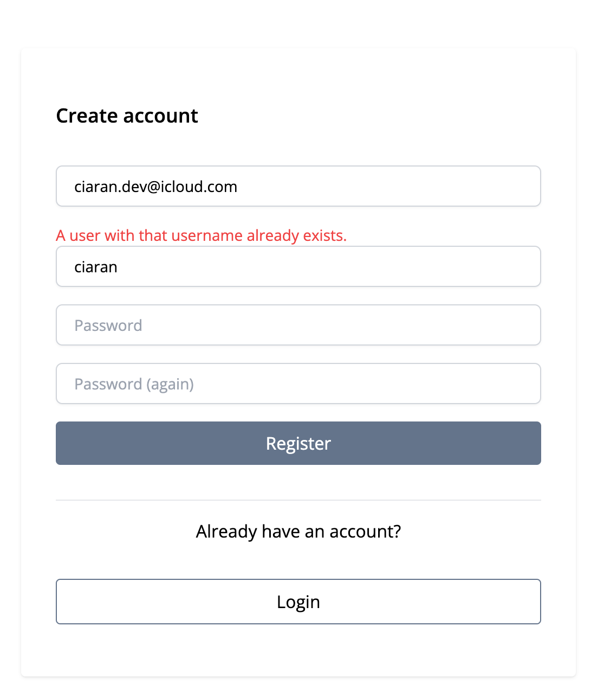
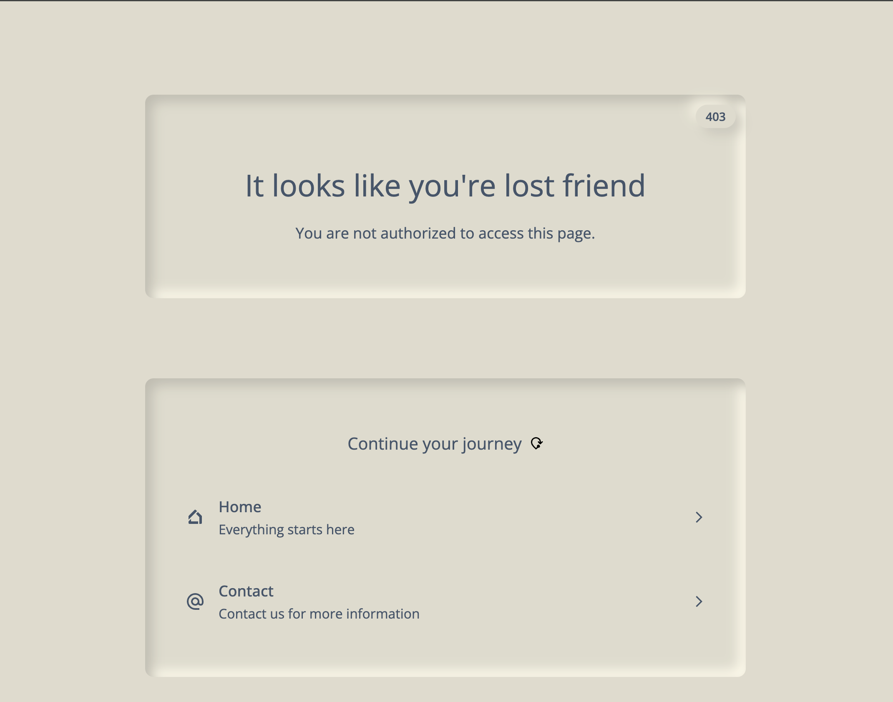
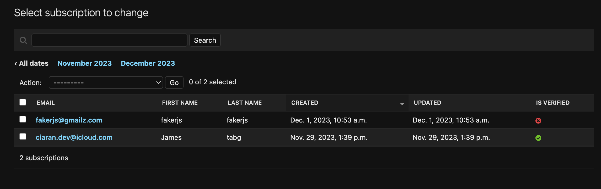
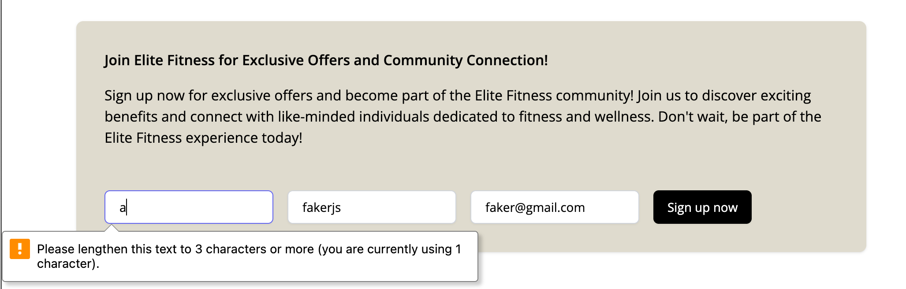
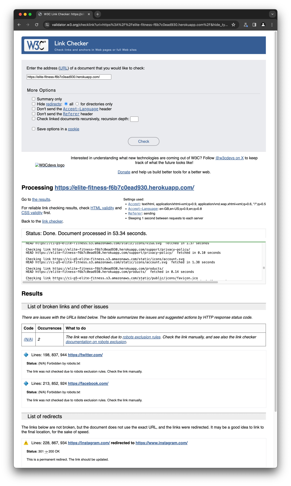

# Security 🔒

**Readme navigation links: 🧭**
- [📕 View Readme documentation](./README.md)
- [🎨 View Design documentation](./DESIGN.md#ux--ui-)
- [🚀 View Deployment documentation (Local & Production)](./DEPLOYMENT.md#deployment-)
- [✨ View Features documentation](./FEATURES.md#features-)
- [🧪 View Testing documentation](./TESTING.md#testing-)
---

The security documentation provides a comprehensive overview of the website's security protocols, inclusive of Django's 
built-in security measures. It includes visual references in the form of screenshots from the website. 
This documentation serves as an invaluable asset for individuals aiming to enhance their comprehension of the website. 
It is systematically divided into sections, with each section dedicated to a specific facet of the website.


## 🔓Security features:

### Deployment

- Ran commands to check for any security issues before deployment:
  - `python3 manage.py check --deploy`
  - Added the following to the settings.py file:
    ```python
      SECURE_BROWSER_XSS_FILTER = True
      SECURE_CONTENT_TYPE_NOSNIFF = True
      SESSION_COOKIE_SECURE = True
      CSRF_COOKIE_SECURE = True
      SECURE_HSTS_SECONDS = 3600
      SECURE_HSTS_INCLUDE_SUBDOMAINS = True
      SECURE_HSTS_PRELOAD = True
      SECURE_REFERRER_POLICY = 'same-origin'
      CSRF_TRUSTED_ORIGINS = ['https://' + os.environ.get('PRODUCTION_HOST')]
      SECURE_PROXY_SSL_HEADER = ('HTTP_X_FORWARDED_PROTO', 'https')
      SECURE_SSL_REDIRECT = True
    ``` 

### User Authentication & Authorisation

I have implemented Django allauth, a powerful, integrated authentication app, to manage user authentication and authorisation in the application. This sophisticated solution provides a robust and secure user authentication system with a suite of features, including:

- User Registration: Users can create their own account.
- User Login: Registered users can sign in to their account.
- User Logout: Users can securely log out from their current session.
- Password Reset: Users can reset their forgotten passwords.
- Email Confirmation upon registration: The system prompts new users to verify their email address post-registration.
- Email Confirmation for password resets: During password resets, users are required to confirm their request via email.

I carried out extensive manual tests to ensure that the authentication system functions as anticipated. During the registration process, users are prompted to provide a valid email address, select a username and create a password.
To bolster security, new users are required to verify their email address through a confirmation email sent upon registration before they can log in. The authentication system is so designed as to prevent duplicate entries, so if a user attempts to register with a username or email that's already in use, the system will prompt them to input a different username or email address.

<details>
<summary>Registration screenshot (username already exists)</summary>


</details>

### Stripe

On the website, I have incorporated Stripe to manage our payment transactions. To ensure real-time responsiveness, a Stripe webhook is set up to actively listen for events generated from Stripe.
When a payment is successfully processed, this webhook is triggered to fulfill two primary actions:

1. It updates the associated Order model within our database, aligning our records with the updated transaction status.
2. Concurrently, it also triggers an email notification to the customer informing them of the successful payment.
3. To enhance the security of these transactions, we have integrated Stripe's JavaScript library throughout the application. This is done by incorporating the file `<script src="https://js.stripe.com/v3/"></script>` into our codebase. It is pivotal for secure collection and transmission of payment information directly to Stripe, ensuring that these sensitive details never interact with our server, offering an additional layer of security.

### CSRF Protection

Django's CSRF protection is automatically enabled, ensuring the security of user sessions.
This safeguard operates by generating a distinct token for each session,
which serves to authenticate the user's requests and thwart potential malicious activities by external parties.
The token is transmitted to the server along with each request,
allowing the server to validate its authenticity prior to processing the request.
Consequently,
this mechanism effectively prevents unauthorised third parties from executing requests on behalf of the user.
Each form submission is validated against this token to ensure that the request is legitimate.

### Defensive Programming

#### Error Handling

Every view underwent rigorous testing
to verify the accurate retrieval of the corresponding HTTP status code and the correct rendering of the designated template.
The error handling features a single custom error page, which dynamically redirects users based on the specific error encountered.
This error page prominently displays the relevant status code and error message in the menubar title,
ensuring clear communication with the user.
The error page also features a link to the homepage, which allows users to easily navigate back to the main page. 

<details>
<summary>Error screenshot (404)</summary>

  
</details>

<details>
<summary>Error screenshot (403)</summary>

  
</details>

Implemented the following error handling:

- 404 - Page Not Found
- 403 - Forbidden
- 500 - Internal Server Error

The above error handling was implemented by creating a `core` app, and adding the following to the `urls.py` file:

```python
  from django.urls import handler404, handler403, handler500
  
  handler403 = Handler403View.as_view()
  handler404 = Handler404View().as_view()
  handler500 = Handler500View.as_view()
```

#### Subscription Form Validation

On the homepage, I have incorporated a subscription form that adheres to specific form and model constraints. This form is designed to foster an easy and secure subscription process, where each input field comes with a minimum length requirement to meet the system's validation rules.

Through this form, users provide the necessary details such as first name, last name & email address. The input fields have been designed keeping user experience and data integrity in mind:

- Full Name: This field ensures that we have the user's complete identity. This field is limited in length to comply with our data model limitations and must exceed a predetermined minimum length to be considered valid.
- Email: The user is required to enter a valid email address. This is crucial for two-stage authentication—after submitting the form, a validation email is sent to this email address. Their email account won't be validated in our database until they click the confirmation link in the email.

The submitted details are all verified in line with the system constraints, thus safeguarding the overall accuracy and reliability of the data stored in our database. Only upon successful email confirmation from the user's end, their entry is marked as verified in the database. This ensures that we have confirmed, consenting subscribers in our database, which improves both user experience and the reliability of our subscriber base.

<details>
<summary>Subscribed users details from admin panel</summary>


</details>

<details>

<summary>Subscription form</summary>


</details>

<details>
<summary>Subscription model</summary>


</details>

#### Automated page link validation

To ensure the utmost user experience and optimal SEO scoring, we used the extensively reliable [W3C Link Checker Tool](https://validator.w3.org/checklink?uri=https%3A%2F%2Felite-fitness-f6b7c0ead930.herokuapp.com%2F&hide_type=all&depth=&check=Check) to perform a meticulous validation of all page links. This tool was designed to systematically detect any broken or dysfunctional links that could potentially impede the user's navigational flow or adversely affect the SEO performance.

<details>
<summary>Screen Capture of W3C Link Validation</summary>


</details>